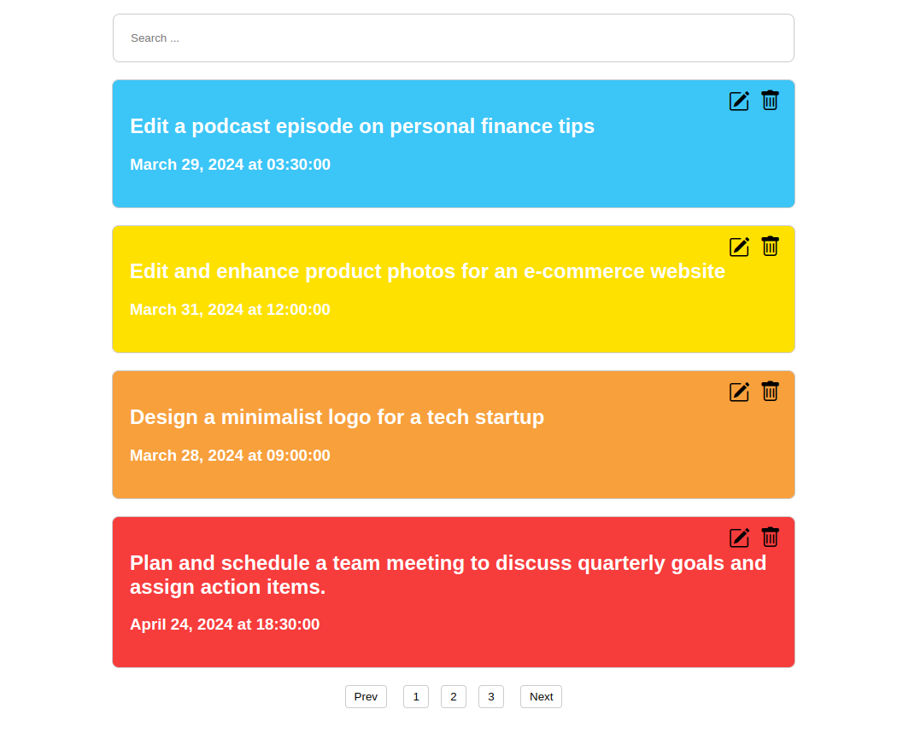

<h1 align="center">
  <picture>
    <source media="(prefers-color-scheme: dark)" srcset="./.github/assets/workeas-logo-light-mode.svg">
    <source media="(prefers-color-scheme: light)" srcset="./.github/assets/workeas-logo-light-mode.svg">
    
  </picture>
</h1>

<p align="center">
  <i align="center">Never forget any task anymore 🚀</i>
</p>

<h4 align="center">
  
  
  
  
  
</h4>

<p align="center">
    
</p>

## Introduction
`Workeas` allows you to manage your tasks in the simplest way. Simplicity is the key advantage of workeas.
Easily add your tasks and set a priority for that task from LOW to CRITICAL and guess what? with a quick glance, 
you can be aware of your critical or high priority tasks and take care of them.

## Documentation
You can read the api documentation made by swagger [here](https://ali-hv.github.io/workeas-docs/).

## Usage
First, clone the repository and move into the cloned directory:
```shell
git clone https://github.com/ali-hv/workeas.git
cd workeas
```
Then, create a python virtual environment:
```shell
python3 -m venv .venv
```
Next, install the requirements
```shell
pip install -r requirements.txt
```
Finally, run the app(run this command in the root directory of the project):
```shell
python3 runserver.py
```

## Change Timezone
Workeas currently just supports ```UTC``` and ```Asia/Tehran``` timezones. The default timezone is ```UTC```,
to change it, open settings.py file in the ```app``` directory and replace ```UTC``` with ```Asia/Tehran```:
```python
timezone = "Asia/Tehran"
```
